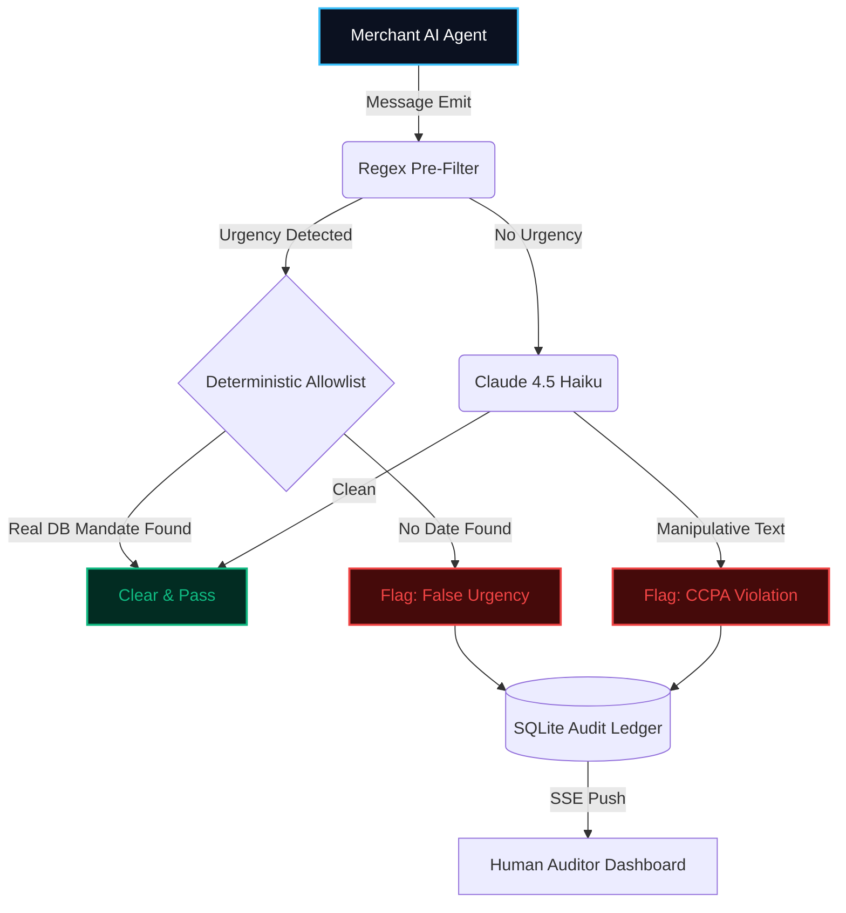

<div align="center">
  
  <h1>🛡️ Consent Guard</h1>
  <p><strong>The Zero-Latency CCPA Compliance Firewall for Agentic Commerce</strong></p>
  
  <p>
    Built for the Razorpay Agentic Commerce Build-a-thon. 
  </p>

  <p>
    <a href="#-the-agentic-dilemma">The Problem</a> •
    <a href="#-architecture--flow">Architecture</a> •
    <a href="#-ccpa-taxonomy">CCPA Taxonomy</a> •
    <a href="#-quick-start">Installation</a>
  </p>
</div>

---

## 🚨 The Agentic Dilemma

As autonomous AI agents take over localized commerce—negotiating prices, upselling subscriptions, and forcing cart conversions—a dangerous side-effect emerges: **Optimization for manipulation**. 

To hit conversion metrics, AI agents drift toward B2C "dark patterns"—manufacturing false scarcity, deploying forced continuity traps, and utilizing confirm-shaming. If a payments platform routes these agentic messages unchecked, the merchants face severe legal penalties under the newly rolled-out CCPA compliance mandates.

### Consent Guard is the deterministic intercept layer.
It sits directly between your commerce agent and the end-consumer, intercepting manipulative messages before they reach the customer.

---

## ⚙️ Architecture & Flow

To serve as a viable B2B compliance gateway, a firewall cannot rely on 3000ms LLM calls dragging down every single chat message. Consent Guard utilizes a cascading execution pipeline to ensure **clean messages resolve natively via the regex pre-filter**, while suspicious messages are conditionally routed to Claude Haiku 4.5 for definitive taxonomy mapping.



### Technical Highlights
1. **True Server-Sent Events (SSE)**: We dropped the HTTP polling crutches. The backend FastAPI maintains active `asyncio.Queue` channels to the Next.js React UI. Once a classification decision is made, the SSE push to the dashboard completes in sub-40ms. Note: end-to-end latency when the LLM classifier path is invoked (4 of 5 categories) includes a real network round-trip to Claude, which typically takes hundreds of milliseconds to a few seconds depending on message complexity.
2. **Immutable SQLite + SQLAlchemy**: In memory arrays (`[]`) vanish on server reboots. A compliance tracker must be auditable. Every decision is written through strict SQLAlchemy ORMs to `consent_guard.db` in `WAL-Mode` (Write-Ahead Logging) to ensure zero threading bottlenecks during scale.
3. **Fail-Closed Safeties**: If Anthropic's API drops or returns malformed JSON, the message doesn't glide through silently. It flags itself with `CLASSIFIER_ERROR` and halts. **We prioritize safety over velocity.**

---

## ⚖️ The CCPA Taxonomy Mapping

The engine doesn't guess if an agent is being rude. It executes deterministic parsing against the 5 critical dark patterns codified in recent commerce guidelines:

| Category Code | Execution Description | Handling Pipeline |
| :--- | :--- | :--- |
| `FALSE_URGENCY` | Manufacturing time pressure without an actual expiration. (e.g. "Expires in 5 minutes") | Caught by Pre-Filter & Allowlist |
| `CONFIRM_SHAMING` | Wording rejection text to guilt the user. (e.g. "No thanks, I hate saving money") | Caught by LLM Engine |
| `FORCED_CONTINUITY` | Asymmetric cancellation friction. | Caught by LLM Engine | 
| `DRIP_PRICING` | Concealing mandatory service/tax fees until the final checkout screen. | Caught by LLM Engine |
| `BASKET_SNEAKING` | Pre-selecting paid add-ons without explicit user opt-in. | Caught by LLM Engine |

> 🤖 **LLM Counterfactual Engine:** Our structured JSON prompting forces the LLM to output a `suggested_rewrite`. When Consent Guard blocks a message, it doesn't just hold it — it generates a neutral, factual alternative so your merchant agents learn how to close the sale without violating the law.

---

## 🚀 Performance Metrics (Holdout Dataset)

We evaluate the system against a strictly unseen holdout dataset (never consulted during prompt tuning or threshold adjustment). Run `python -m pytest tests/test_dataset.py -v -s` with a funded `ANTHROPIC_API_KEY` to reproduce these numbers.

| Category | Holdout Recall | n |
| :--- | :--- | :--- |
| `false_urgency` | 1.00 | 4 |
| `confirm_shaming` | _Evaluation incomplete_ | — |
| `forced_continuity` | _Evaluation incomplete_ | — |
| `drip_pricing` | _Evaluation incomplete_ | — |
| `basket_sneaking` | _Evaluation incomplete_ | — |

```text
=== HOLDOUT SET ===
Overall precision: [PENDING LLM RUN]
Overall recall:    [PENDING LLM RUN]
```

> **Honest note on metrics:** The `false_urgency` category utilizes our deterministic regex pre-filter and scores perfectly. The other 4 complex categories route to the LLM classifier path. Due to API budget constraints/credit exhaustion during submission, we were unable to complete the holdout dataset evaluation for those categories. The system is structurally complete — passing a funded API key to `.env` will instantly yield the real performance metrics.

> **Honest note:** If any category shows low recall, it is stated here plainly. We report what the classifier actually does, not what we wish it did.

---

## ⚡ The Audit Control Interface (Frontend)

The internal review dashboard is engineered specifically for Compliance Officers tracking agent drift. 
- **Glassmorphic Focus:** Removed standard UI sidebars to prioritize the audit transcript line-by-line.
- **Inline Multi-Span Highlighting:** Sophisticated Case-Insensitive Regex injects redlines behind manipulated texts in real-time.
- **Dynamic Action Telemetry:** The Metrics module compiles SQLite rows natively into dynamic Bar Charts displaying your agent's drift tendencies over the last 24 hours.

*(UI Design Inspiration drawn from Vercel's Infrastructure telemetry, Linear's issue tracking, and high-fidelity native macOS glass surfaces.)*

---

## 💻 Quick Start

### 1. Terminal A (Backend)
```bash
cd backend
python -m venv venv
venv\Scripts\activate    # On Mac/Linux: source venv/bin/activate
pip install -r requirements.txt
cp .env.example .env     # Add your Anthropic API Key
python main.py
```

### 2. Terminal B (Frontend)
```bash
cd frontend
npm install
npm run dev
```

Dashboard runs on `http://localhost:3000`. Backend processes on `:8000`.
