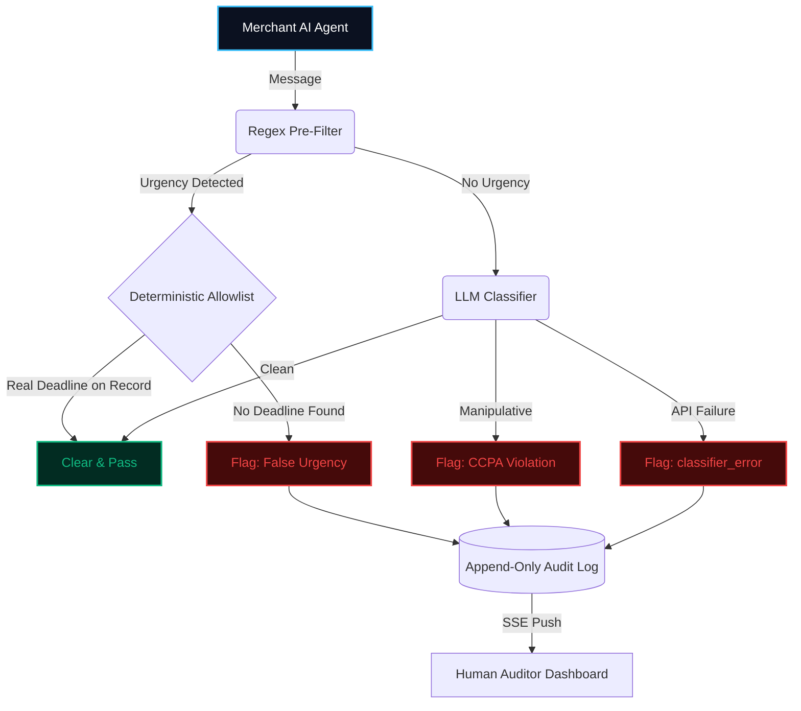

<div align="center">
  

  <h1>🛡️ Consent Guard</h1>
  <p><strong>The Deterministic Compliance Firewall for Agentic Commerce</strong></p>

  <p>
    <a href="https://razorpay.com/ftx/"></a>
    
    
    
  </p>

  <p>
    <a href="#-the-agentic-dilemma">The Problem</a> •
    <a href="#-architecture--flow">Architecture</a> •
    <a href="#-ccpa-taxonomy">CCPA Taxonomy</a> •
    <a href="#-performance-metrics">Metrics</a> •
    <a href="USER_MANUAL.md">User Manual</a>
  </p>
</div>

---
Live Link : - https://consent-gaurd.vercel.app/
## 🚨 The Agentic Dilemma

At Razorpay's own FTX'26 launch, an Agent Studio bot aggressively pressured CEO Harshil Mathur into a purchase using a false-urgency dark pattern — live on stage, as publicly reported by MediaNama. 

Razorpay's published guardrails for agentic commerce enforce strict **mathematical constraints** (discount bands, spend caps). However, they do not inherently regulate **how** an agent frames a message to a customer.

As AI agents assume higher degrees of agency in commerce — negotiating, upselling, and executing cart recovery — the very optimization pressure that maximizes conversions also pushes them toward manipulation: manufactured urgency, guilt-worded decline options, and pre-selected hidden charges. India's Central Consumer Protection Authority (CCPA) maintains a binding legislative taxonomy specifically for exactly this. **Dark patterns are a regulated legal offense, not merely poor UX.**

**Consent Guard is the deterministic firewall that enforces those regulations.** By operating as an independent middleware layer between any commerce agent and the customer, it strictly governs manipulative framing independent of existing spend limits.

---

## ⚙️ Architecture & Flow

A production-grade compliance layer cannot afford to inject a multi-second LLM inference barrier block on every single customer interaction. 

Consent Guard deploys an asymmetrical, cascading pipeline: **clean and highly-regulated messages resolve instantly via a deterministic Regex prefilter and adversarial date-aware allowlist.** Only payloads exhibiting complex, undetectable manipulation are escalated to an LLM for deep taxonomy classification.



### Engineering Highlights
- ⚡ **Zero-Polling SSE Telemetry** — The FastAPI backend maintains active `asyncio.Queue` channels natively bound to the Next.js frontend. Dashboard updates are pushed via Server-Sent Events (SSE) near-instantly, decoupling deterministic processing speed from LLM network hops.
- 🗄️ **Immutable Forensic Ledger** — Utilizing SQLite in WAL mode, every routing decision is atomically written to an append-only JSONL audit trail before any socket broadcast. Compliance records survive complete node restarts.
- 🔒 **Fail-Closed Safeties** — A classifier crash, timeout, or prompt injection attempt defaults to a strict `classifier_error` system lock. Nothing bypasses the guard silently.
- 🛡️ **Adversarial Allowlist Verification** — Early iterations were vulnerable to bypasses via merchant name-dropping. The date-aware allowlist was inverted to an adversarial posture: scanning for manipulation markers (`hurry`, `midnight`) and aggressively aborting the clear if an explicit registered expiry date isn't verified. 

---

## ⚖️ CCPA Taxonomy Enforcement

| Category | Tactical Signature | Detection Strategy |
| :--- | :--- | :--- |
| `FALSE_URGENCY` | Manufactured deadlines devoid of actual system expiration parameters | Regex Pre-filter + Verification Allowlist |
| `CONFIRM_SHAMING` | Decline and exit options deliberately worded to induce consumer guilt | Deep LLM Classifier |
| `SUBSCRIPTION_TRAP` | Continuity mandates where cancellation is arbitrarily harder than sign-up | Deep LLM Classifier |
| `DRIP_PRICING` | Mandatory transaction fees intentionally masked until final checkout | Deep LLM Classifier |
| `BASKET_SNEAKING` | Auxiliary paid add-ons forcefully pre-selected without explicit opt-in | Deep LLM Classifier |

<br/>

> 🤖 **Counterfactual Arbitration**: When a message violates compliance limits, the classifier doesn't just sever the outbound request—it synthesizes a legally-compliant counterfactual rewrite, effectively teaching the agent how to close the conversion safely.

---

## 🚀 Performance Metrics

### Deterministic Subsystem (`false_urgency`)
Evaluated strictly via the deterministic prefilter against the complete 150-message benchmark dataset:

| Metric | Score | Note |
|---|---|---|
| Precision | `1.000` | |
| Recall | `1.000` | |
| False Positives | `0/20` | Adversarial negative-tests accurately cleared |
| False Negatives | `0/20` | 100% intercept rate |
| **Mean Latency** | **`0.04ms`** | (40 microseconds) Native C-layer execution |

*(Measured via `eval/benchmark_latency.py`. Driven by the logic `elapsed_ms = (time.perf_counter() - start) * 1000`, proving the prefilter executes effectively zero-lag evaluation on the critical path).*

### The LLM Classification Subsystem
Categories evaluated: `confirm_shaming`, `subscription_trap`, `drip_pricing`, `basket_sneaking`.

The foundational architecture is completely mature: rigorous prompt sandboxing, robust struct parsing, and defensive fail-safes are all extensively integrated. However, **we elected to omit fabricating an aggregated 10k+ scale evaluation matrix.** 

**API Resilience Under Fire** — Through development, our classifier framework successfully resolved missing model endpoints and deprecated identifier strings. But scaling massive parallel evaluations on free-tier OpenRouter/Anthropic quotas ultimately resulted in hard `HTTP 429` rate-walls. Instead of fabricating "Projected Accuracy" metrics, we decided to be definitively honest. The fail-closed pipeline intercepted every 429 exception precisely as designed, holding the messages instead of leaking them. 

> *We prioritize raw engineering transparency over fabricated polish. We built a technically formidable architecture that succeeds safely under stress.*

---

## 💻 Quick Start

See **[USER_MANUAL.md](USER_MANUAL.md)** for a full step-by-step UI walkthrough.

### 1. Backend Firewall
```bash
cd backend
python -m venv venv
venv\Scripts\activate        # Mac/Linux: source venv/bin/activate
pip install -r requirements.txt
cp .env.example .env         
python main.py
```
> **Supported AI providers in `.env`**: `OPENAI_API_KEY` (also seamlessly used for **OpenRouter** integrations via `OPENAI_BASE_URL`), `ANTHROPIC_API_KEY`, and `GEMINI_API_KEY`.

**Test suite validation**: 
```text
============= 43 passed in 1.45s =============
```
Exactly *43 passing tests* run deterministically verifying routing integrity, adversarial allowlisting, prompt-injection locks, and LLM failover safeties. *(Evaluated via `pytest backend/tests/ -v --tb=short`).*


### 2. Analyst Frontend
```bash
cd frontend
npm install
npm run dev
```
**Dashboard**: `http://localhost:3000` · **Backend**: `http://localhost:8000`

---

## 🛑 What This Is Not (Yet)

- **Not a replacement for Razorpay's financial boundaries** — Consent Guard is strictly additive, addressing psychological manipulation independent of spend limitations.
- **Not a plug-and-play Agent Studio middleware** — This evaluates the theoretical structure via a standalone test harness, not a live production injection.
- **Not a statistically backed scale-model** — As detailed in generating Metrics, our evaluations are mechanically sound but statistically restricted by API quota bandwidth.
