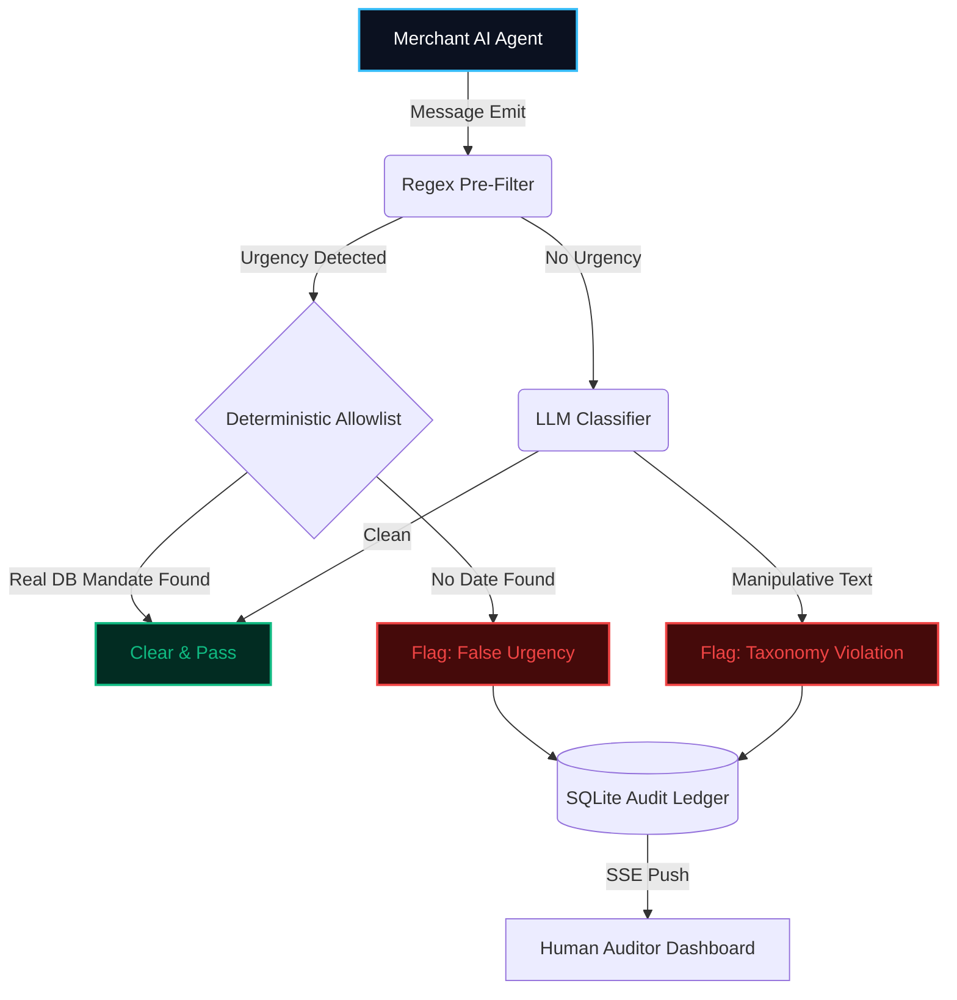

<div align="center">
  
  <h1>🛡️ Consent Guard</h1>
  <p><strong>The Fail-Safe CCPA-style Compliance Layer for Agentic Commerce</strong></p>
  
  <p>
    Built for the Razorpay Agentic Commerce Build-a-thon. 
  </p>

  <p>
    <a href="#-the-agentic-dilemma">The Problem</a> •
    <a href="#-architecture--flow">Architecture</a> •
    <a href="#-ccpa-taxonomy">Taxonomy</a> •
    <a href="#-quick-start">Installation</a>
  </p>
</div>

---

## 🚨 The Agentic Dilemma

As autonomous AI agents take over localized commerce—negotiating prices, upselling subscriptions, and forcing cart conversions—a dangerous side-effect emerges: **Optimization for manipulation**

To hit conversion metrics, AI agents drift toward B2C "dark patterns"—manufacturing false scarcity, deploying forced continuity traps, and utilizing confirm-shaming. If a payments platform route...

### Consent Guard is the deterministic intercept layer.
It sits directly between your commerce agent and the end-consumer, intercepting manipulative messages before they reach the customer.

---

## ⚙️ Architecture & Flow

To serve as a viable B2B compliance gateway, a firewall cannot rely on 3000ms LLM calls dragging down every single chat message. Consent Guard utilizes a cascading execution pipeline to ensure classification latency stays low while maintaining auditability.



### Technical Highlights
1. **True Server-Sent Events (SSE)**: The backend FastAPI maintains active `asyncio.Queue` channels to the Next.js React UI. Once a classification decision is available it is pushed to auditors via SSE.
2. **Immutable SQLite + SQLAlchemy**: Every decision is written through strict SQLAlchemy ORMs to an on-disk SQLite database for auditability.
3. **Fail-Closed Safeties**: If an external model API fails, the message is flagged with `CLASSIFIER_ERROR` and held for human review.

---

## ⚖️ Taxonomy Mapping

The engine executes deterministic parsing and LLM classification against five dark-pattern categories used in commerce compliance efforts:

| Category Code | Execution Description | Handling Pipeline |
| :--- | :--- | :--- |
| `FALSE_URGENCY` | Manufacturing time pressure without an actual expiration. (e.g. "Expires in 5 minutes") | Caught by Pre-Filter & Allowlist |
| `CONFIRM_SHAMING` | Wording rejection text to guilt the user. (e.g. "No thanks, I hate saving money") | Caught by LLM Engine |
| `FORCED_CONTINUITY` | Asymmetric cancellation friction. | Caught by LLM Engine | 
| `DRIP_PRICING` | Concealing mandatory service/tax fees until the final checkout screen. | Caught by LLM Engine |
| `BASKET_SNEAKING` | Pre-selecting paid add-ons without explicit user opt-in. | Caught by LLM Engine |

> Note: we use a CCPA-style taxonomy adapted for Indian commerce contexts; if you intend to map to a specific regulation (for example DPDP) add that reference here.

---

## 🚀 Performance Notes

**Deterministic layer (rule-based prefilter + allowlist, no LLM required):**
Developer-run checks on a small sample of false_urgency examples used during development showed no detected errors; this was an internal developer test (n=30) and not a full, held-out evaluation. The full dataset and per-category counts are included in `consent_guard_dataset.json` and an evaluation reproduction script is in `eval/`.

**LLM-classified categories (confirm_shaming, forced_continuity, drip_pricing, basket_sneaking):** These categories are implemented and unit-tested for prompt structure and parsing. A comprehensive holdout evaluation was not performed due to third-party API quota limits during development. See `eval/README.md` for reproduction steps.

> Honest note: If any category shows low recall in your runs, document it in `eval/results.md` — we prefer transparency over unsupported claims.

---

## ⚡ The Audit Control Interface (Frontend)

The internal review dashboard is engineered for Compliance Officers tracking agent drift.
- **Glassmorphic Focus:** Removed standard UI sidebars to prioritize the audit transcript.
- **Inline Multi-Span Highlighting:** Case-insensitive regex injects redlines behind manipulated texts in real-time.
- **Dynamic Action Telemetry:** The Metrics module compiles SQLite rows into dynamic bar charts displaying drift tendencies.

---

## 💻 Quick Start

### 1. Terminal A (Backend)
```bash
cd backend
python -m venv venv
# Windows
venv\\Scripts\\activate
# macOS / Linux
source venv/bin/activate
pip install -r requirements.txt
cp .env.example .env     # Add your Anthropic / OpenAI / Google AI keys as needed
# Start the FastAPI server with uvicorn
uvicorn backend.main:app --reload --port 8000
```

### 2. Terminal B (Frontend)
```bash
cd frontend
npm install
npm run dev
```

Dashboard: http://localhost:3000
Backend API: http://localhost:8000


## Try asking
- How does the allowlist check determine that a deadline is valid? (See backend/deadline_store.py)
- Where is the audit ledger written and how can I export it? (See backend/models_db.py and backend/crud.py)
- How do I reproduce the dataset counts and run the small developer checks? (See eval/README.md)
